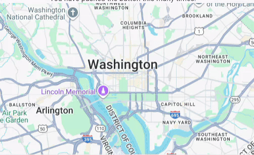

A Flutter plugin to draw and edit polygons on Google Maps in Flutter Web.

This plugin utilizes the dart:js_interop to construct and manipulate the polygons on the Google Map

## 🎥 Demo


## Features

This package/plugin can be used:<br>
- To draw a single polygon on Google Maps<br>
- To render multiple polygons on Google Maps<br>
- To edit a polygon<br>
- Get coordinates of a drawn polygon in WKT format<br>

## Getting started

- Get a Google Maps API key from https://console.cloud.google.com/apis/credentials<br>
  - Enable Maps Javascript API

- Get a Map ID from https://console.cloud.google.com/google/maps-apis/studio/styles<br>
  - Get one by creating a custom style.

## Usage

- [ Simply populate map](#simply-populate-map)
- [ Get coordinates of a drawn polygon](#get-coordinates-of-a-drawn-polygon)
- [ Edit polygon](#edit-polygon)
- [ Get edited polygon coords](#get-edited-polygon-coords)

## Simply populate map
```dart
class MyHomePage extends StatefulWidget {
  const MyHomePage({super.key,});

  @override
  State<MyHomePage> createState() => _MyHomePageState();
}

class _MyHomePageState extends State<MyHomePage> {

  List<PolygonData> polygons = [];

  @override
  void initState() {
    polygons.addAll([
      PolygonData(
        id: 'zone1',
        points: [
          LatLng(34.13323942598082, 71.1073298385321),
          LatLng(33.9192659849147, 70.56076001431335),
          LatLng(33.72303111875004, 71.0908503463446),
          LatLng(34.08093409078901, 71.41769360806335),
          LatLng(34.04908023241135, 71.2721247604071),
          LatLng(34.14460587121248, 71.20346020962585),
          LatLng(34.13323942598082, 71.1073298385321)],
      ),
      PolygonData(
        id: 'zone2',
        points: [
          LatLng(34.030, 71.060),
          LatLng(33.9192659849147, 70.56076001431335),
          LatLng(33.72303111875004, 71.0908503463446),
          LatLng(34.08093409078901, 71.41769360806335),
          LatLng(34.04908023241135, 71.2721247604071),
          LatLng(34.14460587121248, 71.20346020962585),
          LatLng(34.13323942598082, 71.1073298385321)],
      ),
    ],);

    super.initState();
  }

  @override
  Widget build(BuildContext context) {
    return Scaffold(
      appBar: AppBar(
        backgroundColor: Theme.of(context).colorScheme.inversePrimary,
      ),
      body: Center(
        child: Column(
          spacing: 15,
          mainAxisAlignment: MainAxisAlignment.center,
          children: <Widget>[
            const Text('This is your map with polygons'),
            GoogleMapPolygon(
              mapController: GoogleMapPolygonController(),
              mapWidth: 300,
              polygons: polygons,
              mapId: '[YOUR-MAP-ID]',
              mapKey: '[YOUR-MAP-KEY]',
              initialCameraPosition: CameraPosition(initialCoords: LatLng(38.899236, -77.036693)),
            ),
          ],
        ),
      ),
    );
  }
}
```

## Get coordinates of a drawn polygon
```dart
GoogleMapPolygon(
    mapController: GoogleMapPolygonController(),
    mapId: '[YOUR-MAP-ID]',
    mapKey: '[YOUR-MAP-KEY]',
    initialCameraPosition: CameraPosition(initialCoords: LatLng(38.899236, -77.036693)),
    onPolygonCreated: (value) {
      print(value)  
    },
    /// Returns the polygon in WKT format. Default is false. In-case only coordinates are required leave this parameter as false or do not add it at all.
    returnAsWKT: true,
)
```

## Edit polygon
```dart
GoogleMapPolygon(
    mapController: GoogleMapPolygonController(),
    mapId: '[YOUR-MAP-ID]',
    mapKey: '[YOUR-MAP-KEY]',
    initialCameraPosition: CameraPosition(initialCoords: LatLng(38.899236, -77.036693)),
    editPolygon: true,
    singlePolygon: PolygonData(
      id: 'Polygon ID',
      points: List<LatLng>[<Coordinates of points>]
    ),
)
```
NOTE: Editing a polygon requires singlePolygon parameter, and the polygon list to be null. Also, the editPolygon to be true. Default is false.

## Get edited polygon coords
```dart
GoogleMapPolygon(
    mapController: GoogleMapPolygonController(),
    mapId: '[YOUR-MAP-ID]',
    mapKey: '[YOUR-MAP-KEY]',
    initialCameraPosition: CameraPosition(initialCoords: LatLng(38.899236, -77.036693)),
    editPolygon: true,
    singlePolygon: PolygonData(
      id: 'Polygon ID',
      points: List<LatLng>[<Coordinates of points>]
    ),
    /// Returns the polygon in WKT format. Default is false. In-case only coordinates are required leave this parameter as false or do not add it at all.
    returnAsWKT: true,
    onPolygonEdited: (value) {
      print(value);  
    } 
)
```

## Additional information

### Contribution
To contribute or file issue to this package/plugin, check out the [CONTRIBUTING.md](CONTRIBUTING.md) file.
